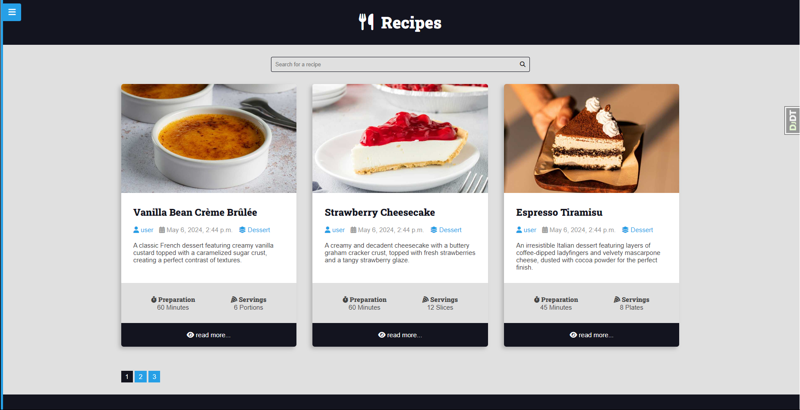
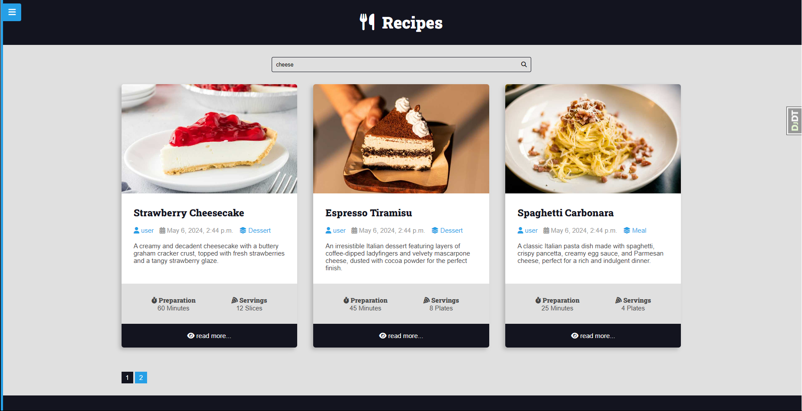
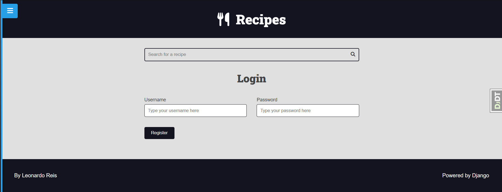
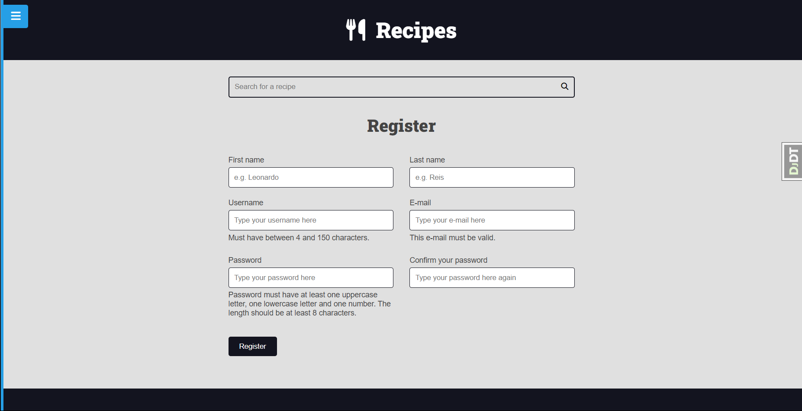
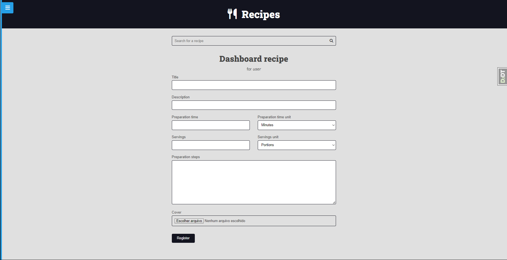
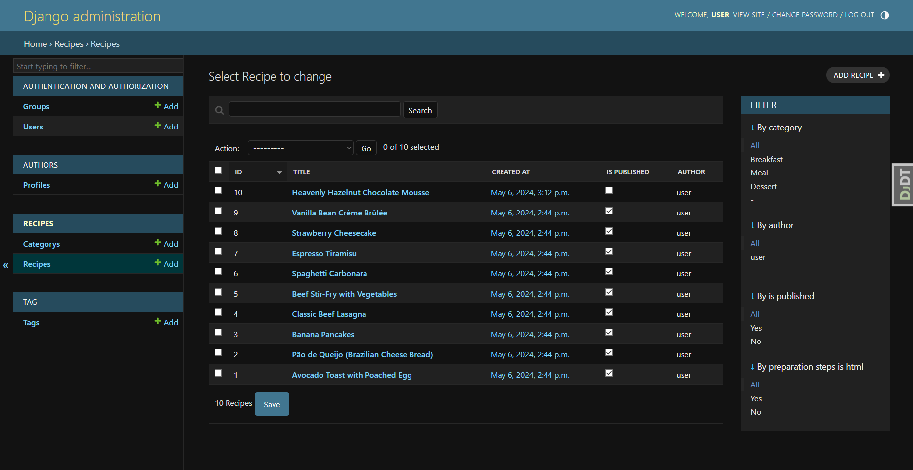
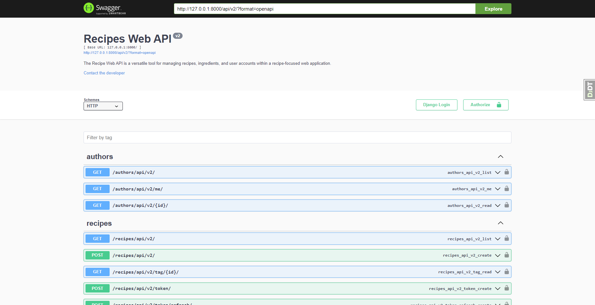

# django-project-recipes

This repository hosts a Recipe Web Application built with Django Framework, developed through Test-Driven Development (TDD). It provides a platform for users to discover, share, and create culinary recipes. Inspired by [Otavio Miranda's](https://www.otaviomiranda.com.br) Advanced Django course.

## Features

### Home

The Home page displays a feed of recipes posted by users and published by administrators.



### Detail

The Detail page allows users to view detailed information about each published recipe.


### Search Engine

The Search Engine allows users to search for recipes or filter them by category/tag.



### Profile

The Profile page displays a brief profile description of a recipe owner.


### Login/Register

The Login/Register pages enable users to create an account or log in to an existing account.





### Create

The Create page allows logged-in users to create and submit their own recipes.



### Dashboard

The Dashboard provides users with an overview of their posted recipes for administrative review.


### Admin

The Admin section, accessible via the `/admin` route on a built-in Django page, empowers administrators to publish recipe posts submitted by common users.



## API Documentation

Additionally, the application includes a REST API feature, which is accessible at the `/api/v2/` route. It provides users with information on available endpoints and their usage. 

Please note that accessing authenticated endpoints requires obtaining a JWT access token by calling the `recipes/api/v2/token/` endpoint first. Make sure to include the JWT access token retrieved from this endpoint in the **Authorize** field at the top of the page with the prefix **Bearer**, like 

```
Bearer <JWT_access>
```



## Getting Started

To run this Recipe Web Application locally, follow these steps:

- **Clone the Repository**

  ```bash
  git clone https://github.com/LeonardoReisC/django-project-recipes.git
  ```

- **Install Dependencies** 

  ```bash
  pip install -r requirements.txt
  ```

- **Set up environment variables with `.env`**

  ```bash
  cp .env-example .env
  ```

- **Migrate Database**

  ```bash
  python manage.py migrate
  ```

- **Seed Database (Optional)**

  ```bash
  python ./utils/seed/main.py
  ```

- **Start the Application**

  ```bash
  python manage.py runserver
  ```

***